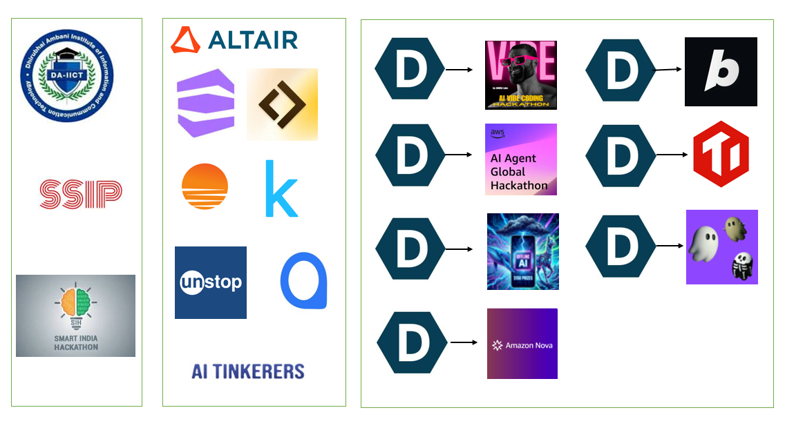

<div align="center">

<!-- Animated Header -->


<!-- Typing SVG -->
<a href="https://git.io/typing-svg">
  
</a>

<br/>


&nbsp;
<a href="https://github.com/MaahinVpanchal?tab=followers">
  
</a>

</div>

---

## 🏛️ Affiliations & Hackathon Ecosystem

<div align="center">

*A snapshot of the institutions, programs, and platforms that shape my journey — from academic roots to hackathon wins and AI communities.*



</div>

---

## 🧑‍💻 About Me

```yaml
name        : Maahin Panchal
title       : Founding AI/ML Engineer @ Aegis Whistle
location    : Ahmedabad, Gujarat, India 🇮🇳
education   :
  institution : L.D. College of Engineering (LDCE), Ahmedabad
  degree      : B.E. — Computer Engineering (Graduate)
  affiliation : Gujarat Technological University (GTU)

currently   :
  - Founding AI/ML Engineer at Aegis Whistle
  - Building SaaS with Vision, RAG & Real-time Agents
  - Enhancing Object Detection systems (SSIP-funded project)
  - Competing in AI/ML Hackathons on Devpost & Unstop

hackathons  : 10 participated | 7 projects shipped on Devpost
achievements: SIH Runner-Up | SSIP Grantee | Kshitij Datathon 3rd Place

goal        : "Build AI solutions that create real-world impact." 🎯
```

---

## 🏆 Achievements & Highlights

<div align="center">

| 🥈 Smart India Hackathon | 🥉 Kshitij 2025 × Altair Datathon | 💰 SSIP Hackathon |
|:---:|:---:|:---:|
| **Runner-Up** – National-level innovation challenge tackling complex real-world problems | **3rd Place** – Ensemble classification model using RapidMiner & AI analytics | **INR 2,49,000 Funded** – Object detection system greenlit for real-world deployment |

</div>

---

## 🔗 Connect With Me

<div align="center">

[](http://www.linkedin.com/in/maahin-vimlesh-panchal)
&nbsp;
[](https://devpost.com/maahinpanchal)
&nbsp;
[](https://github.com/MaahinVPanchal)
&nbsp;
[](mailto:maahinvpanchal@gmail.com)
&nbsp;
[](https://kaggle.com/MaahinVpanchal)
&nbsp;
[](https://unstop.com)

</div>

---

## 🚀 Devpost Projects — 7 Shipped Across 10 Hackathons

> 🔗 **[View Full Portfolio on Devpost →](https://devpost.com/maahinpanchal)**

<div align="center">

| 🏗️ Project | 📝 Description | ⚙️ Built With |
|:---|:---|:---|
| 🎤 **[Amigo](https://devpost.com/software/amigo-dcmekb)** | AI Interview Coach — turns static PDFs into a dynamic real-time voice interview experience | Ragie, ElevenLabs, Voice AI |
| 💻 **[LocalLogic](https://devpost.com/software/locallogic)** | Sovereign offline AI coding with DeepSeek-R1 & RunAnywhere — 100% private, $0 API cost | DeepSeek-R1, Local AI |
| 💊 **[KnowYourMedicine](https://devpost.com/software/knowyourmedicine-s4kv6h)** | Snap a medicine photo → get instant details, wellness tips & multilingual translations | Computer Vision, Healthcare AI |
| 👨‍🍳 **[CookifyAI](https://devpost.com/software/cookifyai)** | AI sous chef with voice chat + photo analysis + auto-generated viral cooking videos | AWS, Voice AI, Vision |
| 👗 **[Atelier](https://devpost.com/software/atelier-custom-fashion-design-platform)** | AI-powered e-commerce for traditional Patola & contemporary fashion with smart chat | NLP, E-commerce, AI |
| 🖼️ **[WallCraft](https://devpost.com/software/image-understanding)** | Next.js wallpaper manager with real-time editing tools, auto-rotation & live preview | Next.js, Image Processing |
| 🦁 **[Wildscape](https://devpost.com/software/wildscape-7tvuih)** | Wildlife conservation platform — earn Carbon Coins for sanctuaries & fund conservation | Social Impact, Gamification |

</div>

---

## 💼 Other Projects

<div align="center">

| Project | Description | Tech Stack |
|:---|:---|:---|
| 🔍 **Google Clone** | Fully functional search engine UI replica | React JS, CSS |
| 📊 **Financial Report Analyzer** | AI-powered balance sheet insights with OpenAI | Python, OpenAI API, Streamlit |
| 🤖 **RAG Chatbot** | Query answering bot from uploaded PDFs/docs | LangChain, Python, Streamlit |
| ⌨️ **Keyboard Object Detection** | Detects keyboard parts in real-time (SSIP-funded) | TensorFlow, Roboflow, OpenCV |
| 📱 **Screen Crack Detector** | Identifies cracked/damaged screen regions | TensorFlow, OpenCV, Python |
| ✈️ **Telegram Bot Automation** | Message delivery and workflow automation | Python, Telegram API |
| 🍽️ **Food Donation Platform** | Connects restaurants & NGOs to cut food waste *(IBM Internship)* | Django, Python, PostgreSQL |

</div>

---

## 🛠️ Tech Stack & Tools

### 📚 Programming Languages
<div align="left">
  
  
  
  
  
</div>

### ⚡ Web Frameworks & Libraries
<div align="left">
  
  
  
  
  
  
</div>

### 🧠 AI / ML / Agents
<div align="left">
  
  
  
  
  
  
  
  
  
  
  
</div>

### 🛢️ Databases & Caching
<div align="left">
  
  
  
  
  
  
</div>

### ☁️ Cloud & DevOps
<div align="left">
  
  
  
  
  
  
  
  
  
</div>

---

## 📊 GitHub Stats

<div align="center">
  
  &nbsp;
  
</div>

<div align="center">
  
</div>

<div align="center">
  
</div>

---

## 🏅 GitHub Trophies

<div align="center">
  
</div>

---

## 📚 Education & Certifications

| 🎓 Degree | 🏫 Institution | 📅 Year |
|:---|:---|:---:|
| B.E. – Computer Engineering | L.D. College of Engineering, Ahmedabad (GTU) | 2021 – 2025 |

### 📜 Certifications & Programs
- 🤖 **Google AI Essentials** – Google
- 🏢 **IBM Internship** – Full Stack Developer (Food Donation Platform)
- 🏆 **Smart India Hackathon 2023** – Runner-Up
- 🥉 **Kshitij 2025 × Altair Datathon** – 3rd Place
- 💰 **SSIP Hackathon** – Funded Project (INR 2,49,000)
- 🎯 **10 Hackathons** completed on Devpost

---

## 💼 Experience

### 🚀 Founding AI/ML Engineer — Aegis Whistle
> Building production SaaS products powered by Vision AI, RAG pipelines & Real-time Agents

### 🧑‍💼 IBM Internship — Full Stack Developer
> Built a **Food Donation Platform** using **Django** connecting restaurants with NGOs to reduce food waste via real-time donation matching

---

## 🌟 Currently Building

```python
current_focus = {
    "role"     : "Founding AI/ML Engineer @ Aegis Whistle",
    "building" : "SaaS with Vision + RAG + Real-time Agents",
    "funded"   : "Object Detection System — INR 2,49,000 (SSIP)",
    "stack"    : ["LangChain", "AWS", "FastAPI", "TensorFlow", "DeepSeek", "ElevenLabs"],
    "goal"     : "Ship AI products that create meaningful real-world impact 🚀"
}
```

---

<div align="center">

### 💬 *"Every project I build is a step toward leveraging technology for meaningful solutions."*

<br/>

[](https://devpost.com/maahinpanchal)
&nbsp;
[](http://www.linkedin.com/in/maahin-vimlesh-panchal)


</div>
